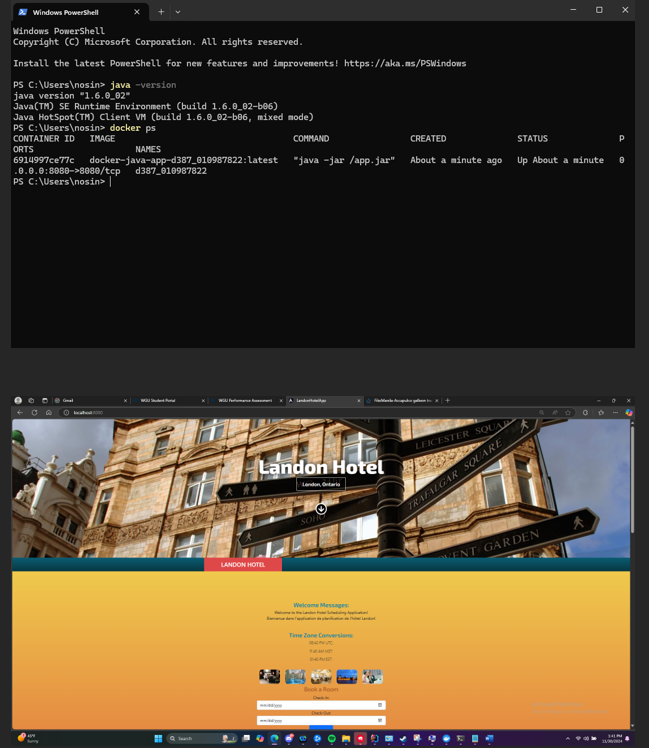
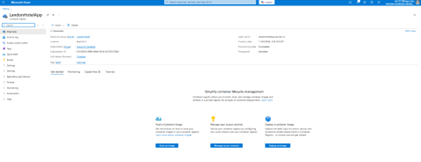
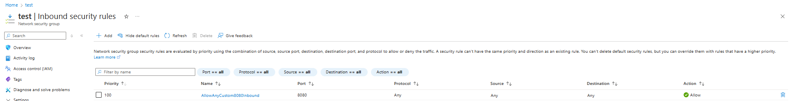
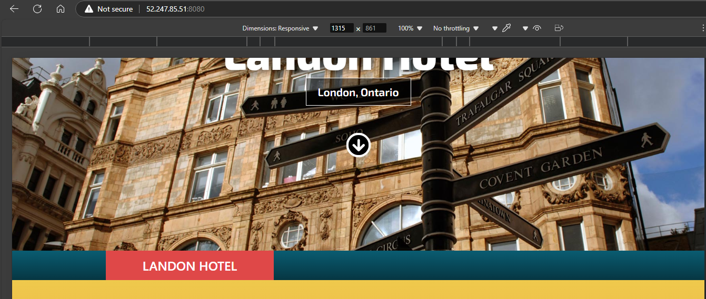

# Test Docker File Locally (Step C2)

# Steps to Deploy a Container to Microsoft Azure and Make it Accessible (Step C3)

**1\. Create a Container Registry**

After creating an Microsoft Cloud Azure Account, create a container registry. A Container Registry is a grouping of one or more containers in Azure.

**2\. Install Azure CLI (az) on Your PC & Tag Your Docker Image**

Install [Azure CLI on your local machine](https://learn.microsoft.com/en-us/cli/azure/) to interact with Azure resources.

- Then, tag your Docker the Docker Image with the Azure Container Registry repository name and tag:

_docker tag dsilverio123/d387_010987822landonhotelapp.azurecr.io/d387_010987822:latest_

**3\. Push Your Docker Image to Azure Container Registry**

Push your locally tagged Docker image to your Azure Container Registry (ACR) to make it accessible for container instances.

- Example command:

_docker push landonhotelapp.azurecr.io/d387_010987822:latest_

**4\. Create a New Azure Container Instance**

Use the Azure CLI locally to create a new Azure Container Instance (which will now be a part of the Container Registry Mentioned in Step 1) and specify the image and OS Type and the required ports.

- Example command:

_az container create --resource-group LondonHotelAppFinal --name londonhotelappfinal --image landonhotelapp.azurecr.io/d387_010987822:latest --os-type Linux --ports 8080 --cpu 1 --memory 1.5 --dns-name-label londonhotelappfinal --location EastUS2_

This command will create the container and use the specific memory and CPU we need.

It will use the image we created as well.

This command also exposes the container on port 8080 (which is needed to view in the browser).

**5\. Create a Network Security Group (NSG) and Allow Inbound Requests for Port 8080**

A Network Security Group defines the inbound and outbound network traffic rules for your container.

- Create an NSG and configure inbound traffic on port 8080 to allow access to the container instance.
- Apply the NSG to the container instance or resource group to ensure that it can accept incoming requests on port 8080.

**6\. Test the Setup**

Verify that your container is running by accessing it via the public IP and port (in this case, <http://135.224.238.180:8080>). This ensures that the application deployed inside the container is accessible externally to anyone on the internet.

